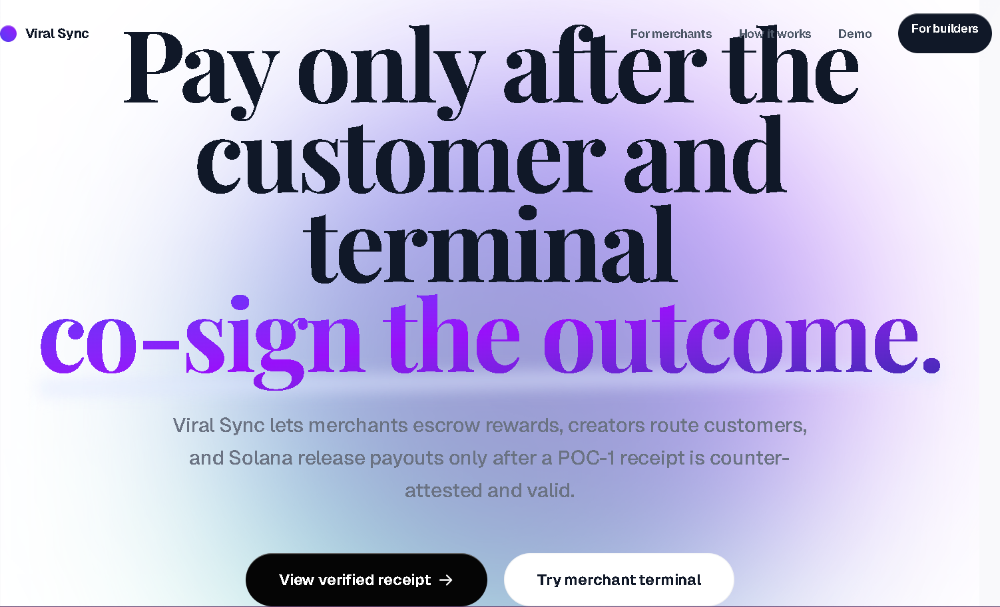
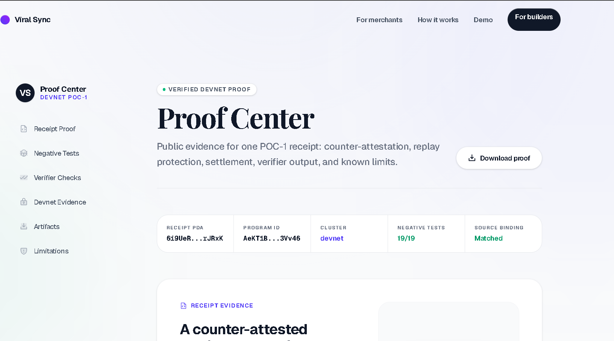
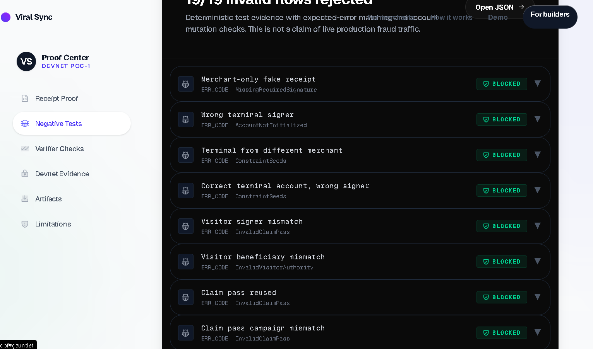
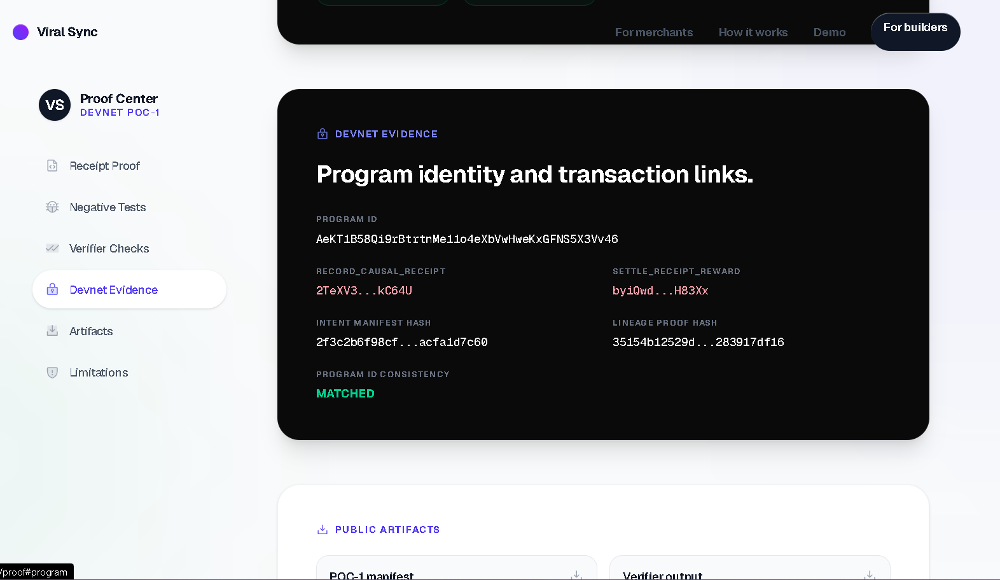

# Viral Sync

Outcome-based referral settlement for local merchants on Solana.

Viral Sync helps local merchants pay for verified outcomes instead of unverifiable clicks. A merchant funds a reward campaign, a visitor claims a pass, the merchant terminal confirms the visit at the counter, and payout only releases after the receipt path is valid.

This repository is a **Devnet POC-1**. It demonstrates the core settlement loop with an Anchor program, proof artifacts, a product-facing Next.js app, an SDK verifier, and a negative-path test suite. It is not claiming production readiness or live merchant traction.

The POC-1 receipt is counter-attested by the merchant authority, an enrolled terminal, and the visitor. Replay is blocked with campaign nullifiers, and settlement is tied to campaign state, reward escrow, and receipt verification.

Judges and technical reviewers can inspect the live app, proof center, devnet transactions, generated proof artifacts, and validation commands below.

<p>
  <strong>Devnet POC-1</strong> ·
  <strong>Solana / Anchor</strong> ·
  <strong>19/19 negative-path checks rejected</strong> ·
  <strong>280 tests passing</strong> ·
  <strong>Not production-ready</strong>
</p>

## Primary Links

| Resource | Link |
|---|---|
| Live app | [https://viralsync1.vercel.app](https://viralsync1.vercel.app) |
| Proof center | [https://viralsync1.vercel.app/proof](https://viralsync1.vercel.app/proof) |
| Pitch video | [https://youtu.be/XwmII_F0LWM](https://youtu.be/XwmII_F0LWM) |
| GitHub repo | [https://github.com/dantwoashim/viral_sync](https://github.com/dantwoashim/viral_sync) |
| Sprint hardening commit | [`44f337a`](https://github.com/dantwoashim/viral_sync/commit/44f337adaaddc1afb64435004848cb0c25684853) |

## Screenshots

| Landing / outcome flow | Proof center overview |
|---|---|
|  |  |

| Negative-path suite | Devnet evidence |
|---|---|
|  |  |

## Weekend Sprint Progress

The sprint focused on hardening the existing Devnet POC-1 and making the public proof surface clearer for judges.

Before:

- The hosted flow was primarily a proof-backed demo path.
- Demo and production pass-signing boundaries were weaker.
- Failed terminal confirmation could expose expected values.
- SDK verifier requirements could drift from the current proof artifact.
- The frontend and proof surface needed a fresh public deployment.

After:

- Production pass signing requires a real `PRODUCT_LOOP_PASS_SECRET`.
- Demo fallback is explicit and marked as demo-only.
- Invalid terminal confirmations no longer leak expected pass codes, MACs, tokens, or derived values.
- Passes include nonce, expiry, campaign binding, terminal binding, merchant binding, and one-time-use state.
- SDK verifier is aligned with the current 19-case negative-path artifact.
- Child-lineage payout binding is strengthened in the Anchor program.
- Devnet proof artifacts were regenerated from a fresh final proof run.
- The updated frontend is deployed to Vercel.

## How It Works

1. Merchant funds campaign escrow.
2. Visitor claims a pass.
3. Merchant terminal confirms the visit at the counter.
4. A counter-attested receipt is recorded.
5. A campaign nullifier prevents replay.
6. Escrow settles the payout after the valid receipt path exists.

The product loop is intentionally narrow for POC-1:

```text
Campaign link -> Claim pass -> Merchant terminal -> Counter-attested receipt -> Nullifier check -> Escrow settlement -> Public proof
```

## Technical Evidence

Important files for review:

| Area | File |
|---|---|
| Product pass lifecycle | `app/src/lib/product-loop/productLoop.ts` |
| Claim-pass API | `app/src/app/api/product-loop/claim-pass/route.ts` |
| Terminal confirmation API | `app/src/app/api/product-loop/terminal/confirm/route.ts` |
| Anchor settlement path | `programs/viral_sync/src/instructions/causal_commerce.rs` |
| SDK verifier helpers | `sdk/src/index.ts` |
| Hardening regressions | `tests/proof-hardening.spec.ts` |
| Negative-path artifact | `app/public/proofs/fraud-gauntlet.json` |
| Devnet proof manifest | `app/public/proofs/devnet-causal-commerce.json` |

The reduced public IDL for the POC-1 surface is available at:

```text
idl/viral_sync_poc1.json
```

## Validation Commands

Install dependencies:

```bash
npm ci
```

Run the protocol and hardening tests:

```bash
npm run test:protocol
```

Expected current result:

```text
280 passing
1 pending
```

The pending test is the gated live localnet validator attack test. It is skipped unless the explicit validator environment is enabled.

Assert final proof artifacts:

```bash
npm run frontier:assert-final
```

Expected current result:

```json
{
  "ok": true,
  "failures": []
}
```

Build the workspace:

```bash
npm run build
```

For the app-only build:

```bash
npm run build --workspace app
```

Current validation summary:

- Protocol and hardening tests: 280 passing.
- Negative-path suite: 19/19 invalid flows rejected.
- Final artifact assertion: `ok: true`, `failures: []`.
- Next.js frontend build: passed.

## Devnet Proof

The POC-1 proof path executes:

1. `register_merchant`
2. `enroll_terminal_device`
3. `create_growth_campaign`
4. `issue_claim_pass`
5. `fund_growth_bounty`
6. `record_causal_receipt`
7. `settle_receipt_reward`

Primary proof artifact:

```text
app/public/proofs/devnet-causal-commerce.json
```

Published verifier artifact:

```text
app/public/proofs/devnet-causal-commerce-verifier.json
```

Negative-path artifact:

```text
app/public/proofs/fraud-gauntlet.json
```

## Repository Structure

```text
app/                  Next.js product app
programs/viral_sync/  Anchor program
relayer/              Sponsored transaction relayer
sdk/                  Verification and PDA helper package
schemas/              Proof artifact schemas
scripts/              Proof, verifier, packaging, and generation scripts
tests/                Protocol and security regression tests
docs/                 Scope, limitations, and review material
```

## Useful Routes

```text
/                     Product landing page
/campaign/[slug]     Campaign offer
/claim/[token]       Visitor claim flow
/merchant/scan       Merchant terminal confirmation
/merchant/today      Merchant operations view
/receipt/[id]        Receipt proof page
/proof               Public proof center
```

## Honest Scope

Viral Sync is a **Devnet POC-1**, not a production-ready protocol.

It does not claim:

- production readiness
- independent physical-world truth
- GPS or POS-verified purchase proof
- live merchant traction
- audit completion
- unrestricted mainnet readiness

POC-1 proves a narrower claim: the devnet program can record and settle a merchant, terminal, and visitor counter-attested receipt with escrow custody, nullifier replay protection, and proof artifacts that bind to the current source, IDL, proof generator, and verifier.

Production readiness requires:

- external audit or security review
- persistent pass/replay storage with atomic consume semantics
- POS/payment or receipt binding
- upgrade authority governance
- monitoring and incident response
- key management
- capped real merchant pilots

## Environment

App:

```text
NEXT_PUBLIC_SOLANA_RPC_URL
NEXT_PUBLIC_PROGRAM_ID
NEXT_PUBLIC_APP_URL
NEXT_PUBLIC_MERCHANT_PUBKEY
NEXT_PUBLIC_RELAYER_URL
PRODUCT_LOOP_PASS_SECRET
VIRAL_SYNC_ALLOW_DEMO_PASS_FALLBACK
LAUNCH_ALLOWED_ORIGINS
```

Relayer:

```text
RPC_URL
RELAYER_SECRET
RELAYER_API_KEY
CORS_ORIGINS
ALLOWED_PROGRAM_IDS
ALLOWED_INSTRUCTION_PREFIXES
ALLOWED_WRITABLE_ACCOUNTS
MAX_TRANSACTION_BYTES=2048
```

After any protocol, verifier, schema, proof-generator, or proof artifact change, rerun the final proof and assertion pipeline before submission.
