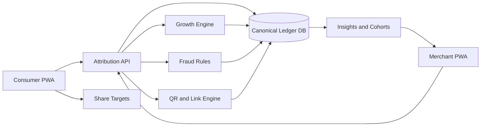

# Viral Sync Nepal
## Zero-Budget Architecture, Launch Engine, and Implementation Blueprint

Last updated: 2026-03-27  
Status: proposed launch architecture  
Audience: founders, product, engineering, design, and go-to-market

## 1. First Principles

This document is intentionally ambitious, but it is not fantasy.

Three truths have to stay visible at all times:

1. No architecture can guarantee zero issues, guaranteed virality, or guaranteed profit.
2. We can still design for asymmetric upside: very low fixed cost, very fast learning, very strong local fit, and very high social spread potential.
3. In Nepal, the highest-probability path is not "crypto launch first." It is a merchant growth product that launches above the payment rails, proves demand cheaply, and only then deepens into PSP-linked infrastructure.

This blueprint is therefore optimized for:

- zero-dollar launch cost
- no Play Store dependency
- no SMS dependency at launch
- no required PSP API access at launch
- fast merchant onboarding
- strong consumer virality
- merchant-funded rewards
- revenue before paid expansion

## 2. Core Product Reframe

### What Viral Sync becomes in Nepal

Viral Sync Nepal is not a public-token protocol.

It becomes:

- an installable PWA
- with two modes: Consumer and Merchant
- focused on referrals, repeat visits, and in-store redemption
- using merchant-funded rewards
- with a central attribution ledger
- and optional deeper payment integrations later

### Product sentence

Viral Sync Nepal is a QR-first, installable growth OS for local merchants that turns every customer into a trackable, rewardable acquisition channel without requiring a new consumer payment app.

### Positioning sentence

For merchants: "Get repeat customers and track who brings them."  
For consumers: "Share places you love and unlock rewards with your people."

## 3. Non-Negotiables

The Nepal version must obey these rules:

- no public transferable token in the consumer journey
- no crypto cash-out mechanics
- no Telegram Stars or TON dependency
- no screenshot-based payment verification as the core settlement model
- no Play Store requirement for launch
- no paid ads for launch
- no paid infra until the product has revenue
- no rewards that create platform-funded cash liability at launch

## 4. The Correct Launch Architecture

The biggest mistake would be trying to launch the final, PSP-integrated dream on day one.

The correct architecture is staged:

### Layer A. Launchable now: voucher and redemption attribution

This is the zero-budget launch layer.

Mechanics:

- customer scans merchant QR
- customer receives a shareable reward link
- friend opens link in PWA
- friend redeems by showing or scanning a dynamic in-app code at the merchant
- merchant confirms redemption in Merchant Mode
- Viral Sync records attribution and unlocks rewards

No PSP integration required.

This is enough to prove:

- customers will share
- friends will redeem
- merchants will care
- merchants will pay for attribution and repeat-visit lift

### Layer B. Revenue-funded upgrade: payment-assisted confirmation

Once the product is earning, move one layer closer to transactions:

- merchant enters bill amount at confirmation time
- merchant or cashier confirms purchase class
- campaign logic can depend on spend band
- anti-fraud rules tighten with merchant-side confirmation flows

Still no deep PSP API dependency required.

### Layer C. Partner-funded or revenue-funded scale: PSP-linked attribution

After proving merchant demand and funding integration:

- dynamic QR integration
- webhook confirmation where available
- merchant wallet and POS partnerships
- automated reconciliation
- optional B2B2B white-label growth layer

This is the correct order.

Do not start at Layer C.

### System view

## 5. Product Architecture

### 5.1 Two-mode structure

The product has exactly two modes:

#### Consumer Mode

Jobs to be done:

- claim an offer
- share with friends
- see progress and rewards
- redeem quickly at the counter
- discover nearby participating merchants
- feel status, momentum, and social proof

#### Merchant Mode

Jobs to be done:

- create offers and campaigns
- scan and verify redemption
- see who is driving visits
- monitor repeat behavior
- manage staff and offer windows
- understand whether the product is paying back

### 5.2 One app, two role-based surfaces

Use one codebase and one installable PWA.

Mode switch should be explicit:

- consumer default entry
- merchant onboarding via invite or approval
- role-based navigation and route protection

This gives:

- one deploy surface
- one brand
- lower maintenance
- easier cross-mode experimentation

## 6. Technical Architecture

### 6.1 Primary stack for zero-dollar launch

Recommended primary stack:

- Frontend: Next.js PWA
- Hosting: Cloudflare Pages
- Edge APIs: Cloudflare Workers or Pages Functions with Hono
- Canonical relational data: Supabase Postgres
- Asset storage: Supabase Storage or Cloudflare R2
- Email magic links and notifications: Resend free tier
- Bot and abuse protection: Cloudflare Turnstile
- Analytics: first-party event tables plus lightweight privacy-first analytics

Why this stack:

- Cloudflare gives free delivery, strong burst handling, and PWA-friendly performance.
- Supabase gives a real relational model for ledgers, campaigns, and redemption history.
- The stack avoids servers, containers, and app-store distribution costs.

### 6.2 Alternative stack if vendor count must be minimized

Cloudflare-only alternative:

- static React or Next.js shell
- Workers for API
- D1 for relational-lite data
- KV for counters and cache
- R2 for assets
- Turnstile for abuse protection

Use this if minimizing vendors matters more than maximizing relational maturity.

### 6.3 Recommended architecture decision

For a world-class zero-budget Nepal launch, the best balance is:

- Cloudflare for delivery and edge
- Supabase for canonical business data

That gives speed, structure, and cheap iteration.

## 7. Identity Without SMS Cost

### 7.1 Consumer identity ladder

Do not spend money on OTP at launch.

Use a three-tier identity model:

#### Tier 0: guest session

- device-local identity
- browser-generated user id
- no login required to browse or claim

#### Tier 1: lightweight account

- passkey or email magic link
- unlocks persistent reward history
- enables cross-device recovery

#### Tier 2: verified account

- only needed for higher-trust mechanics later
- phone verification or partner verification after revenue exists

This avoids spending money before the product earns the right to spend.

### 7.2 Merchant identity

Use:

- founder or owner account
- staff sub-accounts
- passkey-first login
- fallback email magic link
- optional four-digit staff PIN on installed device

## 8. Reward and Ledger Architecture

### 8.1 Do not launch with cash payouts

The product should not become a cash-liability machine on day one.

Launch rewards as:

- discounts
- freebies
- upgrades
- merchant-funded credits
- squad rewards
- streak perks
- neighborhood quest unlocks

This keeps the platform out of the business of holding consumer money at launch.

### 8.2 Canonical business objects

The central data model should include:

- `User`
- `Merchant`
- `MerchantLocation`
- `StaffMember`
- `Offer`
- `Campaign`
- `ReferralLink`
- `ReferralClaim`
- `Redemption`
- `RewardLedger`
- `Quest`
- `Squad`
- `MerchantPlan`
- `PayoutInvoice`
- `FraudSignal`
- `DeviceFingerprint`
- `EventLog`

### 8.3 Event-sourced attribution

Model the business around immutable events:

- offer_created
- referral_link_opened
- referral_claimed
- merchant_code_generated
- redemption_confirmed
- reward_granted
- reward_redeemed
- referral_disputed
- merchant_plan_upgraded

This gives:

- auditability
- dispute clarity
- retroactive analytics
- future PSP reconciliation compatibility

### 8.4 Attribution truth model

At launch, a referral counts as successful only after a merchant-validated redemption event.

Not:

- link click only
- page load only
- screenshot only

This rule is what makes the business credible.

## 9. Merchant Mechanics

Every merchant should have four core loops:

1. Create offer
2. Scan or verify redemption
3. Review today
4. Refine campaign

Start with four campaign types only:

- reward-both referral
- first-visit unlock
- streak reward
- squad reward

This is enough for version one.

### 9.1 Merchant collectives

This is one of the highest-upside ideas in the blueprint.

Instead of onboarding merchants one by one forever, onboard neighborhood collectives:

- one cafe
- one momo or snack spot
- one bakery or dessert place
- one salon or lifestyle merchant

Package them into one district pass.

This creates:

- shared distribution
- stronger consumer utility
- more reasons to revisit
- B2B virality between neighboring merchants

## 10. Consumer Virality Architecture

The product should be built around four loops:

### Loop A. Reward-both sharing

- consumer shares
- friend gets reward
- referrer gets future reward

### Loop B. Squad unlock

- one person starts a group challenge
- all members must redeem in the window
- group reward unlocks

### Loop C. Passport collection

- users collect neighborhood or category stamps
- visible progress triggers repeat visits

### Loop D. Merchant-to-merchant chaining

- redeeming at one merchant unlocks the next nearby partner offer

This creates local route behavior instead of single-merchant one-offs.

Wild but practical growth mechanics:

- `City Pass` across a district
- `Chiya Circuit` for tea and snack routes
- `Exam Mode` for students and study clusters
- `Festival Capsules` for Dashain, Tihar, New Year, wedding and tourism seasons
- `Queue Theater` where redemption visually signals value to people nearby

## 11. Distribution Without the Play Store

The product must ship as:

- a fast mobile web app
- installable to home screen
- with offline shell caching
- and device-friendly performance on cheaper Android phones

Free launch distribution channels:

- merchant counter QR
- table tents and takeaway stickers
- receipt QR
- printed neighborhood posters
- Viber group shares
- Messenger shares
- WhatsApp shares
- Instagram bio links
- TikTok bio and comment CTA loops
- campus ambassadors
- merchant-owned social accounts

Because Nepal has an active regulatory posture around platform registration and social-media oversight, the product should never depend on a single distribution platform.

Make every campaign portable across:

- copy link
- QR
- web page
- Viber share
- Messenger share
- WhatsApp share

## 12. Monetization Engine

### 12.1 The no-profit-no-play rule

The product cannot behave like a venture-backed startup.

That means:

- no paid ads before revenue
- no paid app-store distribution
- no paid SMS before revenue
- no paid PSP integration before revenue
- no paid influencer strategy before revenue

### 12.2 Best launch monetization

The best zero-budget model is merchant-funded performance SaaS.

Launch offer:

- consumer side always free
- merchant first campaign free or near-free
- merchant pays only after verified redemption value is visible

Recommended launch pricing:

- first 30 verified redemptions free
- then either:
- low monthly fee plus performance fee, or
- performance fee only for the first 60 days

Practical starter structure:

- Founding plan: free until first 30 verified redemptions
- Growth starter: NPR 990 to 1,500 per month
- Collective plan: NPR 3,500 to 6,500 for multi-merchant neighborhood pack
- White-label or PSP pack later

### 12.3 Merchant revenue logic

The product makes money when it does one of these well:

- brings net-new customers
- increases repeat visits
- makes campaigns measurable
- lets merchants share acquisition costs across a district

### 12.4 Cash discipline architecture

Every rupee of revenue should be allocated by rule:

- 50% reserve and runway
- 20% product and infrastructure
- 15% legal and compliance
- 10% merchant success and field operations
- 5% experimentation

This prevents premature burn.

## 13. Compliance Boundary Design

### 13.1 What the platform should be at launch

At launch, the platform should be:

- a merchant referral and rewards software product
- a campaign and redemption tracking layer
- a customer attribution engine

At launch, it should not try to be:

- a wallet
- a stored-value financial instrument
- a consumer cash-out system
- a crypto rewards platform

### 13.2 Why this matters

The closer the product gets to holding money, settling third-party value, or touching cross-border value rails directly, the harder and more expensive the compliance burden becomes.

For zero-budget launch, stay one layer above that.

### 13.3 Regulatory upside path

Once the product has evidence, it can pursue:

- merchant partnerships
- PSP partnerships
- formal pilot programs
- sandbox conversations

But that is phase two, not phase zero.

## 14. World-Class Implementation Plan

### 14.1 Phase 0: decision and de-scope

Duration: 1 week

- formally freeze the public-token Nepal launch path
- define the Nepal product as non-crypto
- define one wedge district and one wedge merchant category
- freeze the launch stack and role model

Deliverables:

- finalized PRD
- campaign rules
- database schema
- route map

### 14.2 Phase 1: launchable core

Duration: 2 to 4 weeks

Build:

- consumer PWA shell
- merchant PWA shell
- offer creation
- QR generation
- referral link generation
- redemption verification
- reward ledger
- event logging
- simple analytics
- admin console

Do not build yet:

- deep PSP integration
- cash payout
- advanced segmentation
- native app wrappers

Success bar:

- one merchant can create an offer
- one customer can claim and share it
- one friend can redeem it
- the system records attribution end to end

### 14.3 Phase 2: first real merchant pilot

Duration: 2 to 3 weeks

Target:

- 5 to 10 merchants
- one dense district
- one team member watching redemptions directly

Metrics:

- claim-to-share rate
- share-to-redeem rate
- repeat visit rate
- merchant weekly active usage
- redemption fraud rate
- merchant willingness to continue

### 14.4 Phase 3: viral layer

Duration: 2 to 4 weeks

Add:

- squad rewards
- passport collection
- neighborhood chains
- creator referral pages
- leaderboards
- unlock milestones

Goal:

- make sharing socially expressive, not merely transactional

### 14.5 Phase 4: monetization hardening

Duration: 2 to 4 weeks

Add:

- billing rules
- merchant plan controls
- collective plans
- invoice generation
- merchant performance snapshots
- campaign ROI summaries

### 14.6 Phase 5: payment-assisted and PSP-prep layer

Only after revenue.

Add:

- purchase-band confirmation
- structured redemption reconciliation
- merchant-side spend entry
- webhook-ready architecture
- PSP-specific adapter interfaces

### 14.7 Workstream breakdown

#### Workstream A. Product and rules

- define offer rule engine
- define referral qualification logic
- define duplicate and abuse rules
- define reward expiry behavior
- define merchant collective packaging

#### Workstream B. Consumer app

- claim flow
- invite flow
- redeem flow
- passbook flow
- route and quest flow
- install prompt and offline shell

#### Workstream C. Merchant app

- campaign creation
- scan desk
- staff management
- today dashboard
- ledger and billing
- fraud review tools

#### Workstream D. Backend and ledger

- relational schema
- immutable event log
- idempotent redemption endpoint
- reward issuance service
- fraud scoring service
- analytics rollups

#### Workstream E. Growth tooling

- share link engine
- share card generator
- printable QR generator
- route builder
- leaderboard service
- creator and ambassador invite tools

#### Workstream F. Admin and operations

- merchant approval
- campaign moderation
- manual redemption review
- freeze and unblock tools
- billing and invoice admin

#### Workstream G. Legal and partner prep

- e-commerce registration checklist
- merchant terms
- reward liability model
- data handling map
- PSP and sandbox outreach pack

## 15. Suggested Technical Modules

Frontend modules:

- `consumer-app`
- `merchant-app`
- `shared-design-system`
- `shared-qr-engine`
- `pwa-shell`

Backend modules:

- `auth-service`
- `attribution-service`
- `campaign-service`
- `redemption-service`
- `reward-ledger-service`
- `fraud-service`
- `insights-service`
- `billing-service`
- `admin-service`

Cross-cutting concerns:

- audit logs
- idempotency keys
- abuse detection
- rate limiting
- role-based access
- printable QR asset generation
- background jobs

## 16. Fraud and Abuse Prevention

Launch-level safeguards:

- one device fingerprint per low-trust account
- reward issuance throttles
- merchant-side confirmation required
- no self-referral from same device cluster
- one reward window per offer/user/location combination
- suspicious velocity alerts
- manual freeze tools in admin

Merchant-facing fraud posture:

- suspicious redemption warnings
- duplicate device flags
- staff override audit logs
- top referrers with anomaly scores

## 17. Launch Plan Designed for High Virality

Do not launch nationally.

Launch like a fire:

- one city
- one district cluster
- one merchant category concentration
- one social story

Best first zones:

- Jhamsikhel / Sanepa
- Thamel
- Boudha
- Lakeside Pokhara

Launch week sequence:

### Day 1 to 3

- founding merchants live
- posters and table QRs up
- staff trained
- first city pass active

### Day 4 to 7

- creators and student circles activate shares
- squad rewards turned on
- merchant collective page goes live

### Day 8 to 14

- publish real top merchants and top routes
- launch district leaderboard
- release second quest pack

The zero-budget viral assets:

- QR posters
- table cards
- receipt stickers
- story-ready referral cards
- friend challenge cards
- passport progress visuals
- merchant brag cards

## 18. The Most Important Creative Decision

Do not design the product as "another rewards app."

Design it as:

- part city guide
- part social passport
- part merchant growth engine
- part local status layer

That is what makes it memorable.

## 19. Main Alternatives and When to Use Them

### Alternative A: pure merchant SaaS, no consumer identity

Use only if:

- speed matters more than virality
- merchant analytics is the immediate goal

Downside:

- weaker network effect

### Alternative B: Viber-heavy bot layer plus PWA

Use only if:

- a merchant cohort strongly prefers chat distribution

Downside:

- more platform dependence

### Alternative C: PSP-first integration

Use only if:

- a PSP or large merchant partner funds or opens the integration path

Downside:

- too slow and expensive for zero-budget launch

## 20. Final Recommendation

The masterpiece version of this project under constraint is:

- PWA-first
- consumer and merchant dual-mode
- zero-cost infra stack
- no Play Store
- no paid acquisition
- no crypto
- no payout liability at launch
- merchant-funded rewards
- neighborhood collectives
- passport and squad mechanics
- proof of value before PSP integration

This is the version that can actually launch under severe constraint and still feel inventive, culturally tuned, and commercially sharp.

It will not be guaranteed.

But it is the strongest architecture for maximizing the odds that:

- it launches
- it survives
- it spreads
- it earns
- and only then spends

## 21. Source Notes

Current-context research used for this blueprint:

- DataReportal Nepal 2026: <https://datareportal.com/reports/digital-2026-nepal>
- NRB Payment Systems Department: <https://www.nrb.org.np/departments/psd/>
- NRB Payment System Oversight Report 2023/24: <https://www.nrb.org.np/contents/uploads/2025/01/Payment-Oversight-Report-2023-24.pdf>
- NRB sandbox consultative document: <https://www.nrb.org.np/psd/consultative-document-on-guidelines-on-the-regulatory-sandbox/>
- FIU-Nepal virtual assets page: <https://www.nrb.org.np/fiu/virtual-assets-strategic-analysis-report-of-fiu-nepal-2025/>
- Fonepay official about page: <https://www.fonepay.com/public/about>
- Fonepay 1M QR payments milestone: <https://fonepay.com/public/blogs/Fonepay-QR-1-Million-transactions>
- eSewa anniversary and scale overview: <https://blog.esewa.com.np/16-years-of-innovation>
- eSewa cross-border QR article: <https://blog.esewa.com.np/index.php/esewa-transforms-cross-border-payments-nepal-alipay>
- Khalti business solutions: <https://khalti.com/business-solutions/>
- Cloudflare Pages: <https://www.cloudflare.com/developer-platform/products/pages/>
- Cloudflare Pages docs: <https://developers.cloudflare.com/pages>
- Cloudflare Workers: <https://workers.cloudflare.com/>
- Supabase pricing/docs: <https://supabase.com/docs/guides/platform/org-based-billing>
- Resend pricing/availability: <https://resend.com/pricing/> and <https://resend.com/docs/knowledge-base/does-resend-require-production-approval>
