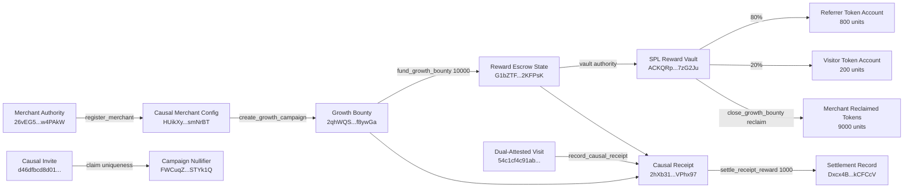

# Localnet Proof Graph

Generated from `tmp/localnet-causal-commerce.json`.

## Accounts

| Object | Address |
|---|---|
| Program | `AeKT1B58Qi9rBtrtnMe11o4eXbVwHweKxGFNS5X3Vv46` |
| Merchant config | `HUikXy5ioj5cyw3Z5HbLtixDcvYUfFyMCJ5SyasmNrBT` |
| Growth bounty | `2qhWQSjpzYhfAceG7v756icEa6Joc2nvJDFn9Bf8ywGa` |
| Reward mint | `2cyWQ57dsBrrc9wJB7TrN96wkvTLhDkPFxPuzofw4qJr` |
| Merchant reward account | `AG4AsAJqLzTAH6XLa6aNswo7BiSMsaxbe9ufcyiy2tM2` |
| Reward escrow | `G1bZTFUUNfGSK2YGqxkyzZYSKf9qoxjW9zmMp52KFPsK` |
| Reward vault | `ACKQRpSpKwzmjZ5yJ53NSzYvmd96sAXVnhXMgM7zG2Ju` |
| Causal receipt | `2hXb31kS1Tjt5MJE44gq3VKsQSnzGVEC4bD3m1VPhx97` |
| Nullifier record | `FWCuqZTgn2KMJYtriGnLsLkjJmazpi19cyGjMiSTYk1Q` |
| Settlement record | `Dxcx4ByDwE2D9FNiFjx8KfrWaA4S6TTaizB8TckCFCcV` |

## Transactions

| Step | Signature |
|---|---|
| Register merchant | `5V6yg5WgcdApaKm1fN2oJN3oxKNhjScE5R5rKvhFoobiEMp3Yx4eguPSzH51ojjkQh4Pz9JDwNqPhFeiixoG23xx` |
| Create Growth Bounty | `2ZZzobrNWLY5Mo9EWodo9sHR4LwrUbW9BW5ZZJ7bZaa9ZBVjKg1LPGuNkUPyDHFWUxV39KqFXiYqdQLkW2dHK8Ny` |
| Mint reward tokens | `2nUt6bjaAVH52DUXhJx5WYFX8F4ytPeqyDLTKZPD9Gc4QktRaAuYZtiQHexCD4FRCsQ2H3vgTUJ35U5v8MLTjXdX` |
| Fund bounty state | `2SVHv8uzjhAUbHju6WUSnL1CKgPGhcsbmFk8Mb53i8pDNTpHF5hYCNLVRq4RqjnwzPWfTYcEKvDXGffgaGYt3gwn` |
| Record Causal Receipt | `4tCC38DrBWKwXwEDhsv6wwBRD8EN6Rz4K4L9J9DRjbb9aTzAXapsFmJyjMPr6jPBdG3uXHZPzsG3Hq8kJXzgqRqv` |
| Settle reward | `2d3V3SxLWVCmiULG7L9FwpTinpUhZbx22GS1HDAnZp1y4Ckgf37EqecT5Xmqt6x9HDKXvrqDYd8NgVEGzLC4GH1b` |
| Close bounty and vault | `2Ri7SxT7X6K6Vhw4nmXYbnmWZnR7NVzBdhvJ4Q4oADjcWYJA3erPwwJrCgn6egeX5rKPGs65W3pQXMAckonQxJsh` |

## Replay Checks

- duplicate campaign nullifier: rejected (Simulation failed. )
- duplicate receipt settlement: rejected (Simulation failed. )

## Token Balances

| Account | Before | After settlement | After close |
|---|---:|---:|---:|
| Merchant reward account | `10000` | `0` | `9000` |
| Reward vault | `0` | `9000` | `closed` |
| Referrer reward account | `0` | `800` | `800` |
| Visitor reward account | `0` | `200` | `200` |
