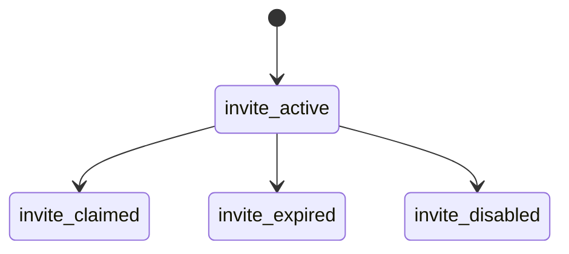
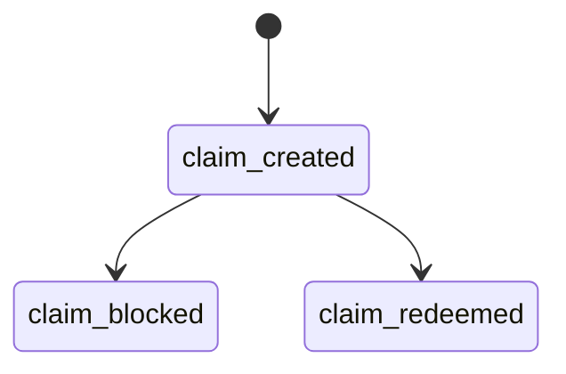
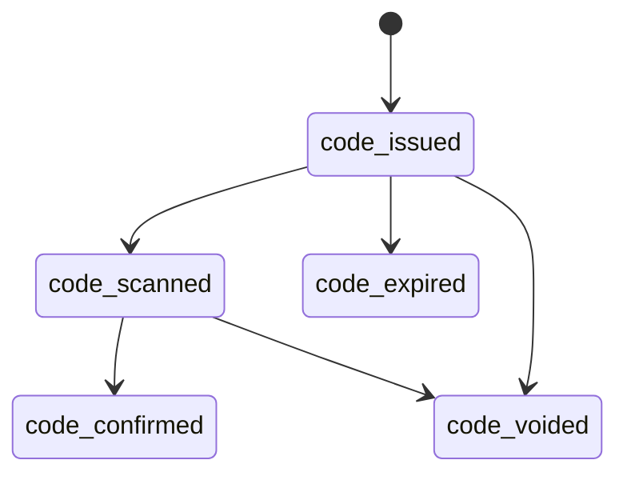
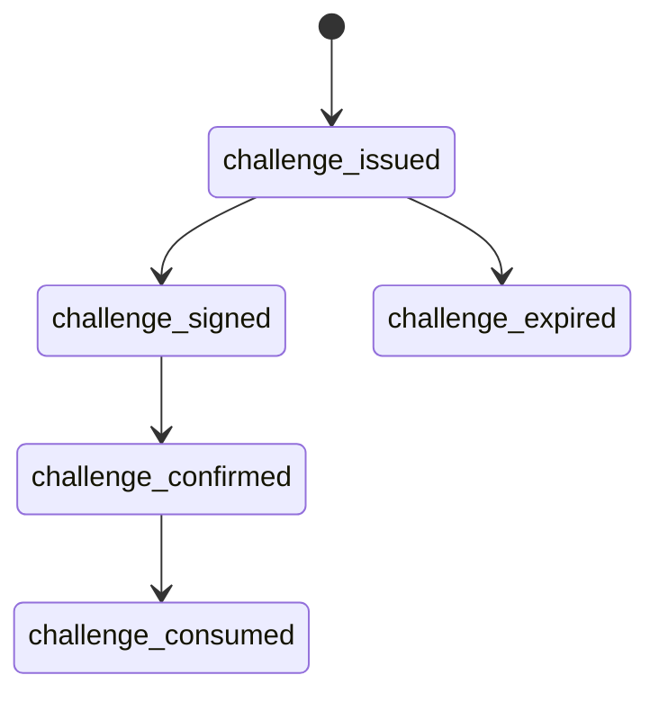

# Launch State Machines

Day 40-50 formalizes core product states so retries, fraud checks, and manager overrides do not create ambiguous money state.

Operational rules:

- Confirmation is idempotent: repeated staff confirmation returns existing receipt/code state.
- Redeem codes are random and stored with a merchant/campaign-bound hash.
- Manual void requires a manager session and reason.
- Outbox jobs isolate side effects such as receipt indexing and notifications.
- Production deployments must use `LAUNCH_DATABASE_URL`; local JSON is development-only.
